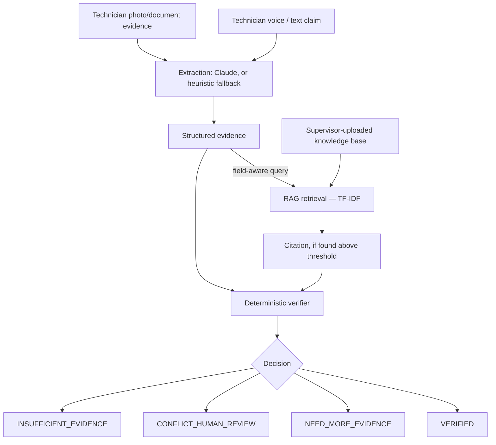

# RealityCheck

**Vocallabs Hackathon Drive · Multimodal Track**

A multimodal AI platform that verifies field-technician service claims by
cross-checking **voice**, **photo/document evidence**, and **retrieved
manufacturer-manual knowledge** against a tolerance-aware checklist — instead
of just trusting "job done."

> **Status:** working end-to-end for all 4 services below, including RAG
> retrieval and citations. `npm run eval` — **27/27 passing**. See
> [Known Limitations](#known-limitations) for what's honestly not done yet.

---

## Problem

A technician reports a job complete and gets paid regardless of whether the
work actually happened, or happened correctly. There's no cross-check between
the claim, the evidence, and the manufacturer's own spec for that reading.

## Solution

RealityCheck asks "prove it." A technician speaks a claim and uploads
evidence; the system extracts structured facts, runs them through a
deterministic checklist verifier with tolerance ranges, and — for fields that
require it — retrieves the relevant passage from a supervisor-uploaded
manual via a lightweight RAG pipeline and attaches it as a citation. The
verifier never invents a spec: if no supporting document can be found, it
says so explicitly (`INSUFFICIENT_EVIDENCE`) instead of guessing.

## Supported services

| Service | task_type | Checklist |
|---|---|---|
| AC Servicing | `ac-service` | machine ID, gas pressure, outlet temperature, 2 photos |
| RO / Water Purifier Servicing | `ro-service` | machine ID, output TDS (reference-backed), filter status, 2 photos, optional job card |
| Refrigerator Servicing | `fridge-service` | machine ID, internal temperature (reference-backed), cooling check, 2 photos, optional job card |
| Washing Machine Servicing | `washer-service` | machine ID, drainage/vibration checks, 2 photos, optional job card |

Each checklist is pure data ([backend/src/checklists.js](backend/src/checklists.js)) —
the verifier, extraction prompts, and eval harness are all checklist-driven,
so adding a 5th service is a config change, not a rewrite.

## How it works



Technician evidence and reference knowledge are **two disjoint systems** —
different tables, different upload endpoints, different UI sections. A
manufacturer manual is never a checklist evidence field and a technician's
job-card upload is never treated as an authoritative spec.

## What the AI API provides vs. what RealityCheck builds

The Claude API (when `ANTHROPIC_API_KEY` is set) provides two raw
capabilities: language understanding (voice claim → structured JSON) and
vision understanding (photo → structured JSON). That's it — no embeddings
API, no agent framework, no vector-DB service.

Everything that turns those two capabilities into a verification system is
hand-built here: the checklist engine, the evidence model (technician vs.
reference, kept structurally separate), tolerance-aware contradiction
detection, deterministic evidence scoring, a field-aware TF-IDF retriever and
citation mechanism, 4 explicit decision states with a fixed priority order,
graceful degradation at every AI-touching step, a 27-case offline eval
harness, and a full audit trail (`agent_runs`). This is not "LLM + prompt +
UI" — the LLM is one interchangeable input to a deterministic decision
engine that never lets it have the final word unchecked.

## Key technical features

- **Deterministic verifier** — no LLM makes the VERIFIED/CONFLICT/etc. call;
  it's checklist-driven arithmetic, hand-rolled, no agent framework.
- **Field-aware RAG** — retrieval queries combine `task_type + field key/label/unit
  + extracted value + raw claim text`, not just the raw claim, so a chunk
  about one specific field outranks unrelated chunks in the same manual.
- **Zero-API-key retrieval** — TF-IDF cosine similarity, pure in-process JS,
  no embeddings API, no external vector-DB service. Works identically online
  or offline.
- **Never fabricates a spec** — below the similarity threshold, retrieval
  reports "not found," which drives `INSUFFICIENT_EVIDENCE` rather than a
  guessed value.
- **Tolerance-aware contradiction detection** — a numeric disagreement is a
  contradiction only past 20% of that field's own tolerance-range width;
  within 8% of an edge is flagged `borderline` (still verified, but scored).
- **Deterministic evidence scoring** — % of required fields matched, minus
  fixed per-status penalties. Never an LLM-invented confidence number.
- **Graceful degradation everywhere** — no API key or a failed call degrades
  to a heuristic regex parser (voice) or presence-only (photos), and to an
  honest "not found" (retrieval) — the pipeline never crashes or fakes a result.
- **Full audit trail** — every extraction, retrieval, and verification call
  is logged to `agent_runs` and viewable in the Supervisor task-detail view.

## Verification states

Priority order — the first that applies wins:

1. **`CONFLICT_HUMAN_REVIEW`** — a reading is outside spec, or two sources
   disagree beyond measurement noise (e.g. voice says machine 27, the
   nameplate photo reads 28).
2. **`INSUFFICIENT_EVIDENCE`** — a reference-backed field (e.g. RO TDS
   output) is otherwise fine, but no supporting manual passage could be
   found — needs a manual uploaded or human review, not more technician evidence.
3. **`NEED_MORE_EVIDENCE`** — something required is missing; asks one
   targeted follow-up question for exactly what's missing.
4. **`VERIFIED`** — everything present, consistent, in range, and
   reference-backed where required. Comes with a 0–100 evidence score.

## Tech stack

- **Backend:** Node/Express (ESM), SQLite (`better-sqlite3`, zero-config,
  schema written to be Postgres-portable later).
- **Extraction:** Claude API (`claude-sonnet-5`) when `ANTHROPIC_API_KEY` is
  set — one text call, one vision call, both prompts built dynamically from
  the task's checklist. Regex/heuristic fallback otherwise.
- **RAG:** `pdf-parse` for PDF text extraction; hand-rolled TF-IDF
  cosine-similarity retrieval (`backend/src/rag/`) — no embeddings API, no
  vector-DB service.
- **Frontend:** React + Vite, plain CSS, browser `SpeechRecognition` API for
  mic input (no raw audio ever reaches the backend — only the transcript).

## Evaluation

```bash
cd backend && npm run eval
```

**27/27 passing (100%)**, as of the last run on this branch. Cases 1–20 are
the original AC-only suite (happy path, each required field missing
individually, contradictions, out-of-range, boundary/borderline values, type
coercion, decision-priority rules, optional fields) — untouched throughout
this work. Cases 21–27 cover RO/fridge/washer, a wrong-checklist robustness
case, and both RAG outcomes (citation found → VERIFIED, no citation found →
`INSUFFICIENT_EVIDENCE`), using fixture references so the suite stays fully
offline and deterministic — never a real PDF/DB/network call.

## Run locally

You need [Node.js](https://nodejs.org) 18+ and npm.

### 1. Backend

```bash
cd backend
npm install
cp .env.example .env   # optional: add ANTHROPIC_API_KEY, else runs on heuristic fallback
npm run eval             # sanity check — should print 27/27 passed
npm run dev               # API on http://localhost:3001
```

SQLite, uploaded evidence, and indexed knowledge-base files are created
under `backend/data/` (gitignored) on first run; all 4 checklists are
seeded automatically.

### 2. Frontend

```bash
cd frontend
npm install
npm run dev   # UI on http://localhost:5173
```

- **/technician** — pick a service, speak/type a claim, upload evidence, run
  verification.
- **/supervisor** — task queue (filterable by service), per-task evidence
  trail, citations, and the full `agent_runs` audit log.
- **/supervisor/knowledge** — upload a reference manual (PDF/.txt) for a
  service, or as a general document.

Without `ANTHROPIC_API_KEY`, voice claims use the heuristic regex fallback
(id/number fields only — free-text fields like "filter replaced" honestly
come back missing rather than guessed) and photos are presence-only. RAG
retrieval needs no key at all — it works identically either way.

## Known limitations

- **Heuristic voice fallback only covers `id`/`number` fields** — free-text
  checklist fields (filter status, cooling/drainage checks) aren't
  regex-extractable, so without a working API key those show as missing
  rather than a guessed value. Honest, but means a full offline VERIFIED
  demo needs those typed in manually or a real key.
- **RAG is TF-IDF, not semantic embeddings** — deliberately, for a
  zero-API-key hackathon build; a larger real corpus would benefit from real
  embeddings, which the retrieval interface (`rag/retrieve.js`) is small
  enough to swap in later without touching the verifier.
- **No auth** — the technician/supervisor split is routing only, not
  accounts; anyone can upload a knowledge document.
- **No job queue** — verification and RAG retrieval run synchronously; fine
  at hackathon scale, not at high concurrency.
- **Service auto-detection is deferred** — task type is chosen manually via
  the selector; keyword-based auto-suggestion was scoped out to protect
  P0/P1 time (see the plan this was built from).
- **Chunking is fixed-size (800 chars, 100 overlap), not sentence-aware.**

---

## Repo structure

```
Reality Check Voice Agent/
├── backend/
│   └── src/
│       ├── verifier.js          # deterministic decision engine
│       ├── verifier.eval.js     # 27-case offline eval harness
│       ├── checklists.js        # all 4 service checklists (data only)
│       ├── server.js
│       ├── db/                  # schema, seeding, checklist lookup
│       ├── extraction/          # voice/photo -> structured fields (checklist-driven)
│       ├── rag/                 # pdf text extraction, chunking, TF-IDF retrieval
│       └── routes/               # tasks, claims, evidence, verifications, checklists, knowledge
└── frontend/
    └── src/
        ├── App.jsx, api.js, styles.css
        ├── pages/                # Home, Guide, Technician, Supervisor, TaskDetail, Knowledge
        └── components/           # StatusPill, FieldBreakdown
```

*Built for the Vocallabs Hackathon Drive, Multimodal Track.*
