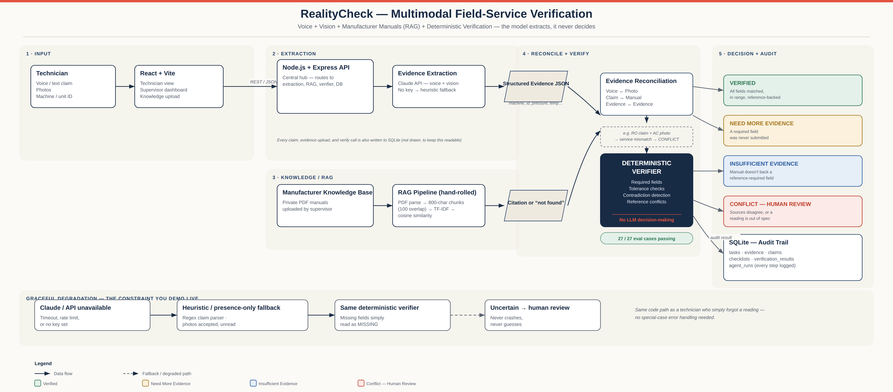
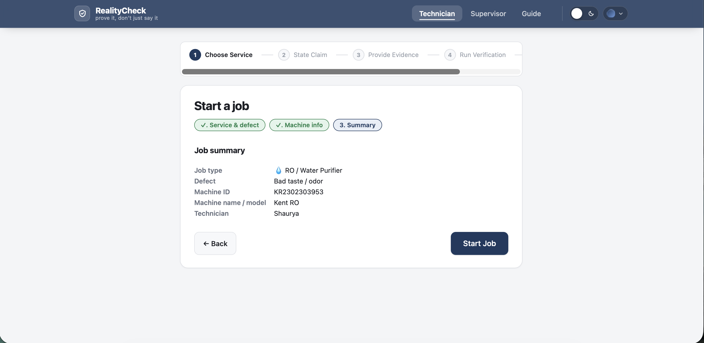
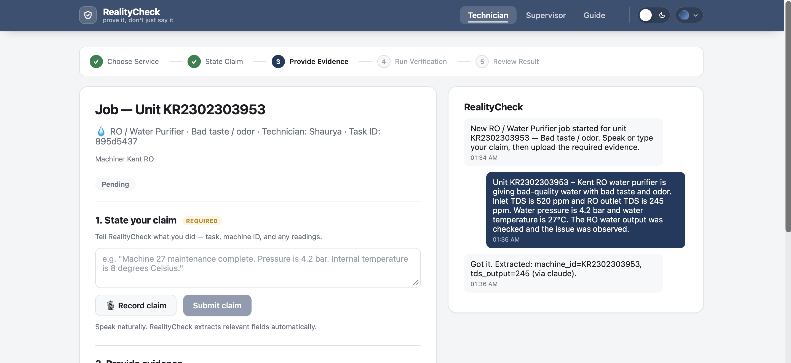
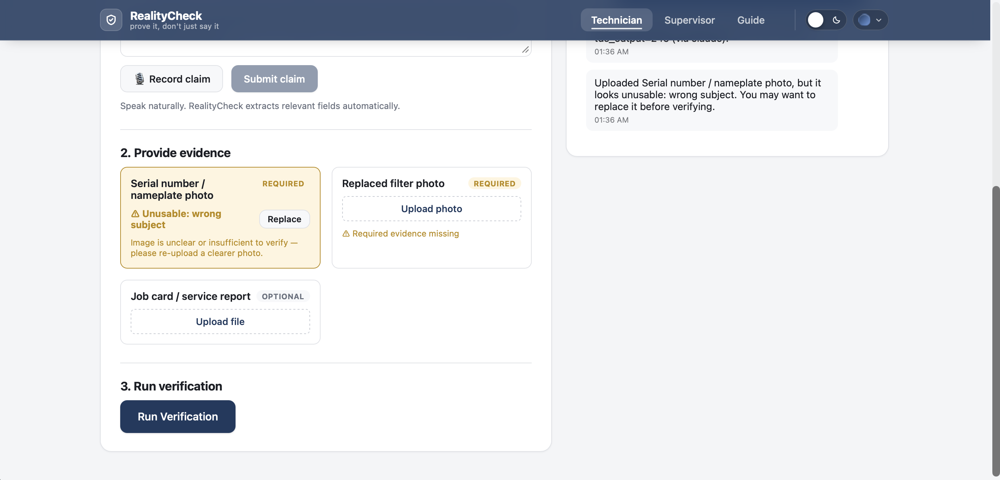
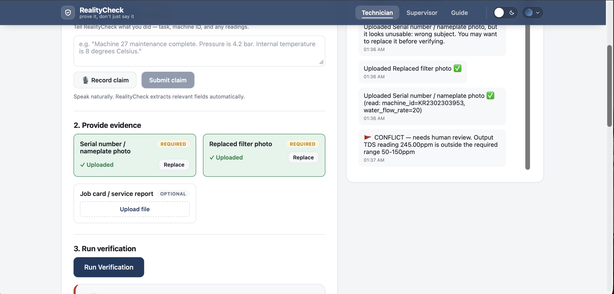
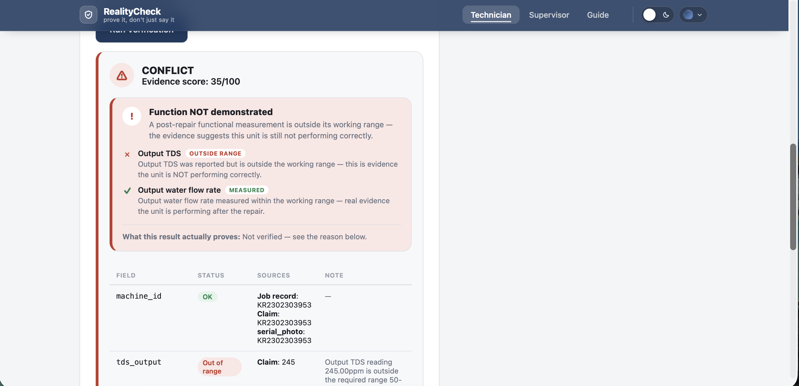
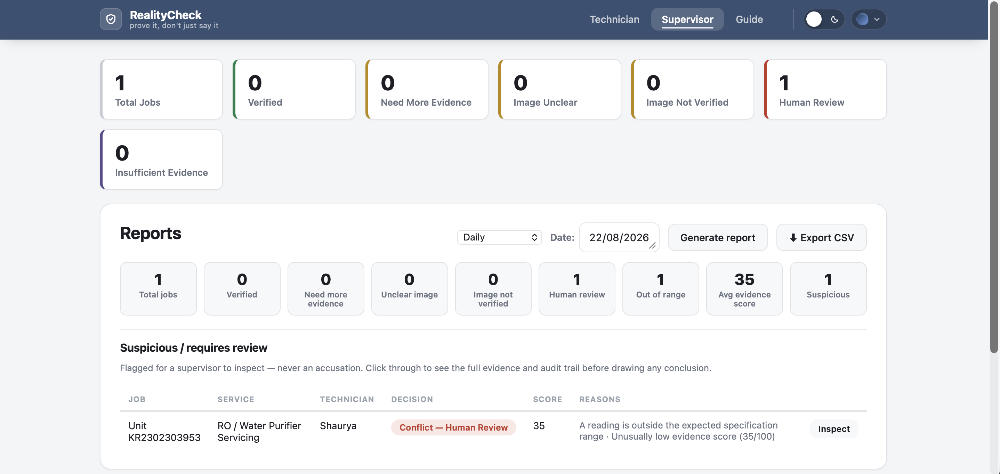

# RealityCheck

**Vocallabs Hackathon Drive · Multimodal Track**

Verifies field-technician service claims by cross-checking **voice**,
**photo evidence**, and **retrieved manufacturer-manual knowledge** against a
tolerance-aware checklist — instead of just trusting "job done."

> **Status:** working end-to-end for all 4 services, including RAG retrieval
> and citations. `npm run eval` — **27/27 passing**.

---

## Problem → Solution

A technician reports a job complete and gets paid regardless of whether it
actually happened correctly — there's no cross-check between the claim, the
evidence, and the manufacturer's own spec.

RealityCheck asks "prove it." A technician speaks a claim and uploads
evidence; the system extracts structured facts, runs them through a
**deterministic checklist verifier** with tolerance ranges, and — for fields
that require it — retrieves the relevant passage from a supervisor-uploaded
manual via RAG and attaches it as a citation. It never invents a spec: no
supporting document found → `INSUFFICIENT_EVIDENCE`, not a guess.

## Architecture



Technician evidence and reference knowledge are **two disjoint systems** — a
manufacturer manual is never treated as technician evidence, and a
technician's job card is never treated as an authoritative spec.

## Walkthrough

A real conflict caught end to end: a reported reading falls outside the RO
unit's working range, even after the technician fixes a rejected photo.

| Step | |
|---|---|
| **1–2. Start a job** — machine info, then a summary before starting. |   |
| **3. State the claim** — voice/text claim; fields extracted automatically. |  |
| **4. Evidence rejected** — vision review flags a photo as the wrong subject. |  |
| **5. Evidence fixed, reading still flagged** — photo passes; TDS is already out of spec. |  |
| **6. Result: CONFLICT** — score 35/100, output TDS outside the 50–150ppm range. |  |
| **7. Supervisor review** — flagged job queued for human inspection, not accusation. |  |

## Supported services

| Service | task_type | Checklist |
|---|---|---|
| AC Servicing | `ac-service` | machine ID, gas pressure, outlet temperature, 2 photos |
| RO / Water Purifier | `ro-service` | machine ID, output TDS (reference-backed), filter status, 2 photos |
| Refrigerator | `fridge-service` | machine ID, internal temperature (reference-backed), cooling check, 2 photos |
| Washing Machine | `washer-service` | machine ID, drainage/vibration checks, 2 photos |

Each checklist is pure data ([backend/src/checklists.js](backend/src/checklists.js)) — adding a 5th service is a config change, not a rewrite.

## Key features

- **Deterministic verifier** — no LLM makes the VERIFIED/CONFLICT call; hand-rolled, checklist-driven arithmetic.
- **Field-aware RAG** — TF-IDF cosine similarity, zero embeddings API, works identically online or offline.
- **Never fabricates a spec** — below the similarity threshold, retrieval reports "not found" → `INSUFFICIENT_EVIDENCE`.
- **Tolerance-aware contradiction detection** — flags disagreements past 20% of a field's tolerance width.
- **Graceful degradation** — no API key or a failed call falls back to heuristics, never crashes or fakes a result.
- **Full audit trail** — every extraction, retrieval, and verification call logged to `agent_runs`.

## Verification states (priority order)

1. **`CONFLICT_HUMAN_REVIEW`** — a reading is outside spec, or sources disagree.
2. **`INSUFFICIENT_EVIDENCE`** — reference-backed field is fine, but no manual passage found.
3. **`NEED_MORE_EVIDENCE`** — something required is missing.
4. **`VERIFIED`** — present, consistent, in range, reference-backed. 0–100 evidence score.

## Tech stack

- **Backend:** Node/Express (ESM), SQLite (`better-sqlite3`)
- **Extraction:** Claude API (`claude-sonnet-5`) when `ANTHROPIC_API_KEY` is set, else regex/heuristic fallback
- **RAG:** `pdf-parse` + hand-rolled TF-IDF retrieval (`backend/src/rag/`)
- **Frontend:** React + Vite, browser `SpeechRecognition` API for mic input

## Run locally

Requires [Node.js](https://nodejs.org) 18+.

```bash
# Backend
cd backend
npm install
cp .env.example .env   # optional: add ANTHROPIC_API_KEY, else heuristic fallback
npm run eval            # should print 27/27 passed
npm run dev              # API on http://localhost:3001

# Frontend (new terminal)
cd frontend
npm install
npm run dev   # UI on http://localhost:5173
```

- **/technician** — pick a service, speak/type a claim, upload evidence, run verification.
- **/supervisor** — task queue, evidence trail, citations, audit log.
- **/supervisor/knowledge** — upload a reference manual (PDF/.txt).

## Known limitations

- Heuristic voice fallback (no API key) only covers `id`/`number` fields — free-text fields come back missing rather than guessed.
- RAG is TF-IDF, not semantic embeddings — deliberate, zero-API-key choice.
- No auth — technician/supervisor split is routing only.
- No job queue — verification runs synchronously.

---

*Built for the Vocallabs Hackathon Drive, Multimodal Track.*
